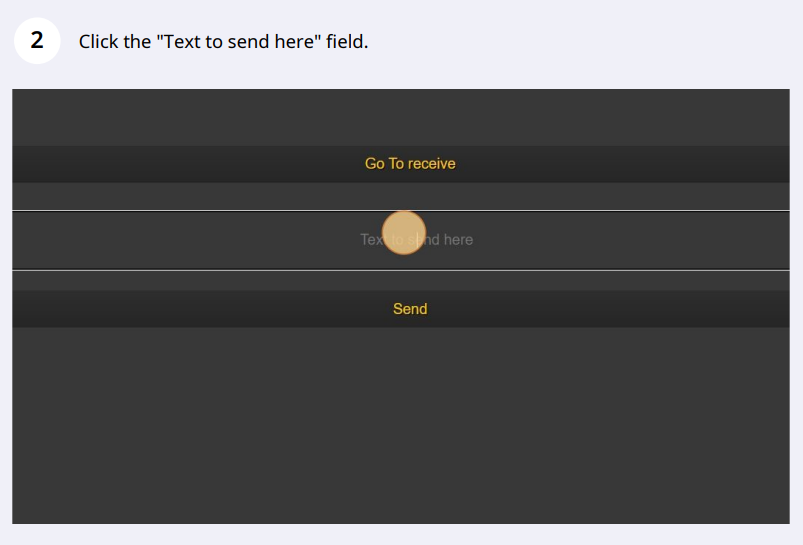
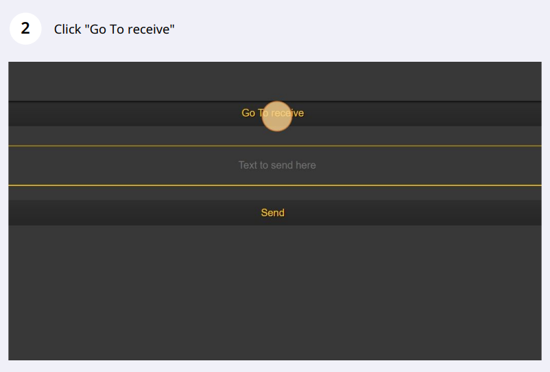
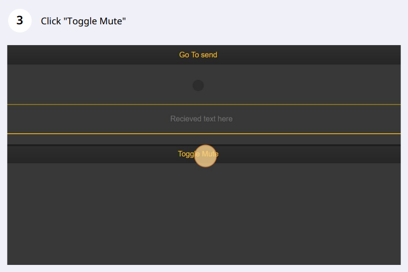
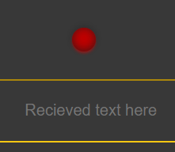
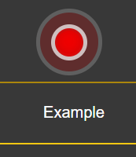

# What sine-messaging-react is
A website that uses javascript's web apis to send and receive data wirelessly between devices using only sound (At inaudible frequencies by default).\
Regarding the front-end it was built using the React library.

# How it works
The text is converted to binary using Utf-8.\
Using a AudioContext oscilator it generates and transmits through the speakers a sine wave of a specified frequency for some pre-determined milliseconds.\
The frequency depends on the pair of bits currently being broadcast.\
Ex:\
`00` -> ``18200hz``\
`01` -> ``18400hz``\
`10` -> ``18600hz``\
`11` -> ``18800hz``

The listner then analises the amplitude of each frequency using a fast fourier transform to detect the distinct signature of a signal over the background noise.\
When that happens it'll log the frequencies received over the duration of the message.\
Finally it will read the data and decode it to binary by counting how long each sine wave lasted.\
Ex: In a very simplified way, if it recorded the following frequenncies during the transmission `18400hz, 18800hz, 18200hz, 18600hz`, because we know what pair of bits each 
frequency represents, we know that the signal was `01110110` and can decode it to obtain that character `v`.

# How to use it
Navigate to https://gugajazz.github.io/sine_messaging_react on a chromium based browser.

## Send data

Type your message ( Expect around 1s for each character to be sent on default settings )

## Receive data

While waiting the red light will look as shown 
When a signal is coming in ripples will appear as shown 

# Warnings
By default, sine-messaging-react uses frequencies between 18200hz and 18800hz. Frequencies in this range usually aren't audible by humans but can and will still cause hearing damage if listened to at unsafe levels.\
It is then recommended  that for short range communication ( <5m ) the users use a low volume, which usually is enough, and increase it progressively if necessary to achieve reliability opperation at longer ranges.

# Results
This project was mostly a proof of concept to show that data can be transmited through sound at inaudible frequencies using common, every-day hardware, across platforms and fully offline (excluding loading the website).

With that being said there are multiple paths that could and perhaps will be taken in the future to improve performance and reliability.
The default settings aim to work across the widest range of hardware, from phones to tablets, PCs and maybe some fridges. For those reasons they can be tweaked to vastly improve the trasmition times. 

Results with **default** settings:

- Bit rate:\
Little over 8 bits / second. Aka 1 character a second or a Baud rate of 1. 

- Range:\
Multiple meters while remaining at a safe volume and small error rate.

# Changing default settings:
In order for the transmission and reception of data to work it's necessary that every device communicating shares the same values for their settings.\
This is the case by default but must be taken in to consideration when chaging the settings. 
